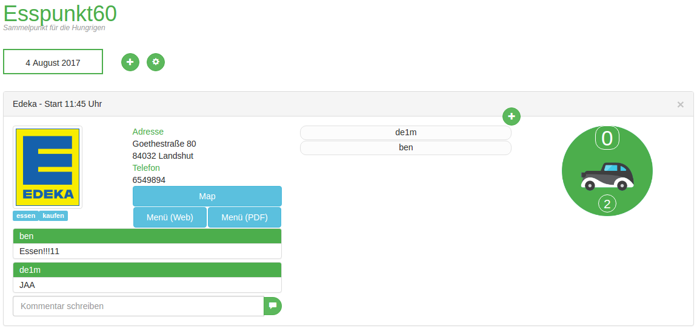

# Esspunkt60



## Description
This is a litle Web Application written in Node.js.
The data are stored in MongoDb and the uploaded files (Images and PDF files) are saved on local disk.

With this web app you can create an eating day plan. For example you will eat today in a restaurant. You create a eatpoint and another colleague can add himself to this eatpoint.

## Getting started
### Requiments without Docker

- Node > 6.0
- Mongo

For start without docker you need to edit two files 

#### "app/databases/index.js" 

You can edit the file or you an set environment variables

```
    var mongoAddr = process.env.MONGOADDR || 'localhost';
    var mongoPort = process.env.MONGOPORT || '27017';
    var mongoDb = process.env.MONGODB || 'esspunkt60';
    var mongoUser = process.env.MONGOUSER || 'essen';
    var mongoPass = process.env.MONGOPASS || 'essen6003';
```

#### "app/public/js/app.js" 

```
    var socketAddr = '_WEBSOCKETADDR_';
    var socketPort = '_WEBSOCKETPORT_';
```
**_WEBSOCKETADDR_** - Addresse of the server
**_WEBSOCKETPORT_** - Port of websocket, equal the website port (80 or 443)

### Requiments for Docker

- Docker > 1.18

Show the file docker-compose.yaml
Edit this file if needed.

```
      - WEBSOCKETADDR=mongo
      - WEBSOCKETPORT=5000
      - MONGOADDR=mongo
      - MONGOPORT=27017
      - MONGODB=esspunkt60
      - AUTH=false
```
If you need, you can enable mongo authentification (AUTH=true), use for this the variables "MONGOUSER=user" and "MONGOPASS=pass"
